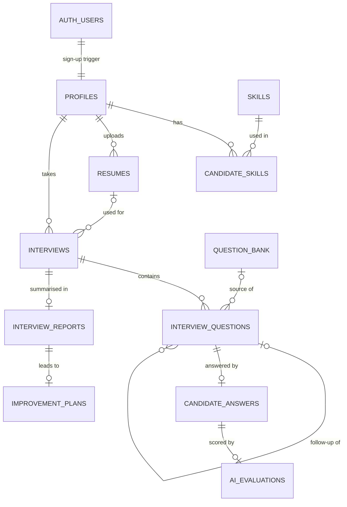

# Database

AI Interview Arena uses **Supabase PostgreSQL** with row level security (RLS), Supabase Auth for accounts and Supabase Storage for resume files. The schema lives in [`supabase/migrations`](../supabase/migrations) and is applied with the Supabase CLI.

| Migration | Contents |
| --- | --- |
| `…01_schema.sql` | Enums, tables, indexes, `updated_at` triggers, settings row |
| `…02_security.sql` | `is_admin()`, sign-up trigger, `candidate_profiles` view, RLS policies |
| `…03_storage.sql` | Private `resumes` bucket (PDF/DOC/DOCX, 5 MB) and its policies |
| `…04_seed_data.sql` | 48 skills and 65 question-bank questions across all roles, types and difficulties |
| `…05_lock_down_privileges.sql` | Least-privilege grants for the API roles |
| `…06_question_source_resume.sql` | `resume` question source (questions built from the candidate's resume) |
| `…07_more_questions.sql`, `…08_more_role_questions.sql` | 64 more questions — 129 in total, at least 8 per role for technical interviews |
| `…09_ai_provider_setting.sql` | AI provider choice in the admin settings |
| `…10_avatars.sql` | Public `avatars` bucket for profile photos (JPG/PNG/WebP, 2 MB); users write only in their own folder |
| `…12_login_attempts.sql` | `login_attempts` (email, IP, time of each failed sign-in) for the wrong-password lockout; server-only (RLS on, no policies, no grants) |
| `…11_job_description.sql` | Optional `job_description` and `job_match` on interviews; `gap` question source (questions on skills the job needs that the resume doesn't show) |

## Entity relationships



## Tables

| Table | Purpose | Key columns |
| --- | --- | --- |
| `profiles` | One row per user (the **users** table). Created automatically on sign-up. | `id` → `auth.users`, `role` (candidate/admin), `status`, `full_name`, `email`, `phone`, `education`, `experience_level`, `experience_summary`, `preferred_role` |
| `candidate_profiles` (view) | Candidate profiles with their skills and latest resume. | Everything in `profiles` + `skills[]`, `latest_resume_id` |
| `skills` | Shared skill vocabulary. | `name` (unique, case-insensitive), `category` |
| `candidate_skills` | Skills a candidate has, from their resume or added manually. | `user_id`, `skill_id`, `source` |
| `resumes` | Uploaded resume file and the AI-extracted profile. | `storage_path`, `file_type`, `file_size` (≤ 5 MB), `raw_text`, `parsed` (JSON), `status` |
| `question_bank` | Curated questions managed by admins. `job_role` null = all roles. | `question`, `job_role`, `skill`, `difficulty`, `interview_type`, `expected_answer`, `is_active` |
| `interviews` | One mock interview and its configuration. | `job_role`, `experience_level`, `interview_type`, `difficulty`, `status`, `started_at`, `ended_at`, `overall_score`, `job_description` (optional), `job_match` (resume vs job: `required`, `matched`, `gaps`, `match_percent`) |
| `interview_questions` | Main questions (`source`: `bank`, `resume` or `ai`) and AI follow-ups. Follow-ups share the parent's `position` with `follow_up_index` 1, 2… (shown as Q3a, Q3b). | `position`, `follow_up_index`, `parent_id`, `question`, `skill`, `source`, `bank_question_id`, `expected_points` (server only) |
| `candidate_answers` | The candidate's answer to a question (typed or voice transcript). | `question_id` (unique), `answer_text`, `mode`, `skipped`, `duration_seconds` |
| `ai_evaluations` | AI scores (0–100) for one answer. **Estimates, not objective measurements.** | `technical_accuracy`, `relevance`, `communication`, `clarity`, `completeness`, `problem_solving`, `answer_quality`, `question_score`, `feedback`, `needs_follow_up` |
| `interview_reports` | Final report for a completed interview. | `overall_score`, area scores, `strengths[]`, `improvements[]`, `skill_scores` (JSON), `summary` |
| `improvement_plans` | Personalised career feedback for a report. | `weeks`, `recommended_topics`, `practice_questions`, `suggested_projects` (JSON), `preparation_tips[]` |
| `app_settings` | Single row of admin settings. | `questions_per_interview`, `allow_follow_ups`, `max_follow_ups_per_question`, `allow_voice_answers`, `show_question_scores`, `max_resume_mb` |

### Enums

| Enum | Values |
| --- | --- |
| `job_role` | Full Stack Developer, Frontend Developer, Backend Developer, Data Analyst, Data Scientist, AI/ML Engineer, Digital Marketing Executive, HR Executive, Business Development Executive |
| `experience_level` | `fresher`, `0-1`, `1-3`, `3-5`, `5+` |
| `interview_type` | `technical`, `hr`, `behavioral`, `managerial`, `mixed` |
| `difficulty` | `easy`, `medium`, `hard`, `expert` |
| `interview_status` | `setup` → `ready` → `in_progress` → `completed` (or `abandoned`) |
| `question_source` | `bank`, `resume` (resume project), `gap` (skill gap from the job description), `follow_up`, `ai` |

These match `src/lib/constants.ts`.

## Security model

- **User-level data isolation.** Every candidate-owned table has RLS policies of the form `user_id = auth.uid() or is_admin()`. A candidate can only ever see their own profile, resumes, interviews, answers, evaluations, reports and plans.
- **Admins** (`profiles.role = 'admin'`) can read all candidate data and manage the question bank and settings. `is_admin()` is a `SECURITY DEFINER` function so policies can call it without recursion.
- **Least privilege.** Signed-out visitors (`anon`) have no table access. Signed-in users get only the operations they need; for example they can update their own name and phone but not `role` or `status`, and they cannot read `interview_questions.expected_points`.
- **Trusted writes.** Answers, AI evaluations, reports and improvement plans are written only by server code using the secret key, after it has checked who the caller is. Candidates cannot write or change scores.
- **Resume storage.** The `resumes` bucket is private and only accepts PDF, DOC and DOCX up to 5 MB. Files are stored at `resumes/<user id>/…`; users can only upload, read or delete inside their own folder, and admins can read all.
- **Profile photos.** The `avatars` bucket is public-read (photos appear in the app header) but only accepts JPG, PNG and WebP up to 2 MB, and each user can only write or delete inside `avatars/<user id>/`. The saved URL is checked on the server before it is stored in `profiles.avatar_url`.

### Verifying the rules

`npm run test:db` creates two temporary users, attempts 28 allowed and forbidden actions (reading another user's data, promoting yourself to admin, reading answer keys, uploading into someone else's folder, wrong file types, oversized files, admin access), and deletes the users afterwards.

## Working with migrations

```bash
npx supabase login                      # once per machine
npx supabase link --project-ref <ref>   # once per clone
npm run db:push                         # apply new migrations
npm run db:types                        # regenerate src/lib/supabase/database.types.ts
npm run test:db                         # re-run the security tests
```

### Making a user an admin

Run in the Supabase SQL editor:

```sql
update public.profiles set role = 'admin' where email = 'admin@example.com';
```
